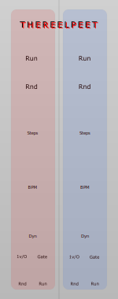

# TheReelPeet-Dyn



**TheReelPeet-Dyn** is a dual generative sequencer built around probabilistic note phrasing. Rather than playing every step, each lane uses a **Dynamics** knob to shape the musical character — bending notes into sustained holds or dropping them into silence, in a way that breathes and evolves over time.

Each lane produces a randomized 1V/Oct pitch sequence with an independent Rise/Fall envelope, making it well-suited as a self-contained melodic voice or modulation source.

TheReelPeet-Dyn runs natively on both **VCV Rack 2** and the **4ms MetaModule** from a single codebase.

TheReelPeet-Dyn is licensed under the [MIT license](./LICENSE).

---

## Overview

TheReelPeet-Dyn contains **two independent sequencer lanes (A and B)**, each with:

- Randomized pitch CV per step
- Variable step length and per-lane BPM
- **Dynamics** knob for probabilistic holds and drops
- **Rise** and **Fall** knobs for per-note envelope shaping
- 1V/Oct pitch output
- Envelope CV output (0–10V)

The lanes are symmetrical but fully independent. Using different step lengths and BPM values between lanes creates evolving, phase-shifting melodic textures that never quite repeat.

---

## Controls & I/O (per lane)

### Run
Toggle button that starts and stops the sequencer lane. A green LED indicates running state.

### Rnd
Momentary button that randomizes all pitch values in the lane.

### Length
Sets the number of steps in the sequence (2–16).

### BPM
Sets the tempo for the lane (1–240 BPM). The current value is displayed below the knob.

### Dynamics
The core personality control. Turning clockwise increases the probability of **note holds** (sustained legato notes that last a full sequence cycle). Turning counterclockwise increases the probability of **note drops** (silent steps, creating rests). At noon, every step fires as a normal short trigger.

- Probability uses a cubic curve for natural feel — subtle at low settings, aggressive near the extremes.
- A new note will never fire until the current envelope has fully completed (A-166 style gate logic).

### Rise / Fall
Small knobs that set the attack (0–2s) and decay (0–4s) time of the per-note envelope. The envelope output follows an AR shape, with a sustain phase held for the full duration of a hold.

### Outputs
- **1V/Oct** — Current pitch CV. Freezes at the last fired note value until the envelope completes.
- **Envelope CV** — 0–10V AR envelope output. Use with a VCA, filter, or any CV destination.

---

## Intended Use

TheReelPeet-Dyn works best as a **self-contained generative melodic voice**:

- Patch the 1V/Oct output through an external quantizer for harmonic control.
- Patch the Envelope CV into a VCA to hear the hold/drop dynamics directly as volume shaping.
- Use different step lengths and BPM values per lane to create evolving, non-repeating polyrhythmic textures.
- Drive the Envelope CV into a filter cutoff for expressive timbral motion.
- Let the two lanes drift against each other — the phase relationship shifts naturally over time.

---

## Building

### VCV Rack 2

Requires a working [VCV Rack development environment](https://vcvrack.com/manual/PluginDevelopmentTutorial) with the Rack SDK at `../Rack`.

```bash
make
make install
```

### 4ms MetaModule

Requires the [MetaModule Plugin SDK](https://github.com/4ms/metamodule-plugin-sdk) and ARM GNU Toolchain 12.3.

```bash
cmake -B build-mm -DCMAKE_TOOLCHAIN_FILE=../MyModule-metamodule/sdk/cmake/arm-toolchain.cmake
cmake --build build-mm
```

Output: `build-mm/out/thereelpeet-dyn.mmplugin`
